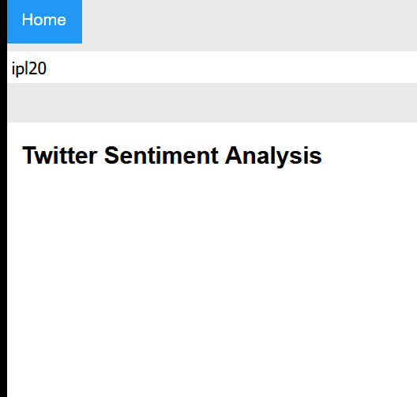
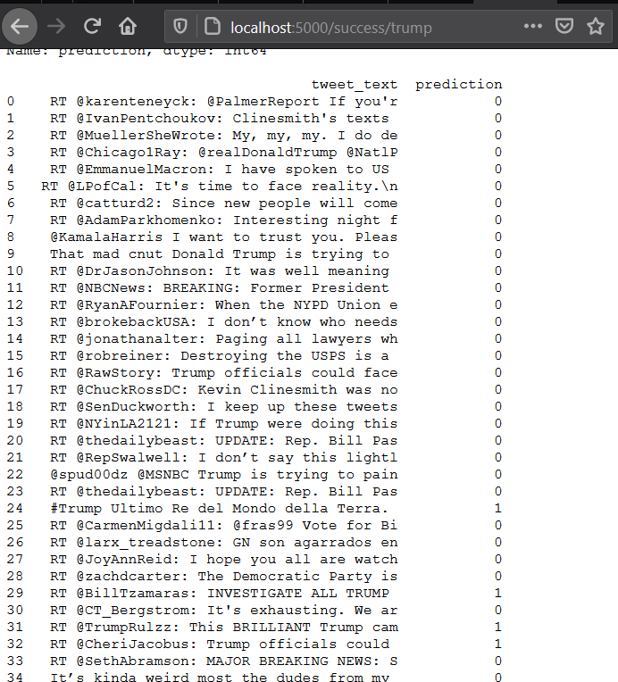

# Hate speech classification

[working]

It retrieves top tweets using tweepy and then analyses whether it is hate speech using hate speech classification. 0 for non hate speech. 1 for hatespeech.
dataset: https://www.kaggle.com/vkrahul/twitter-hate-speech

Original creator : https://github.com/lakshay-arora/Hate-Speech-Classification-deployed-using-Flask/tree/master

ref: https://www.analyticsvidhya.com/blog/2020/04/how-to-deploy-machine-learning-model-flask/

____

My file hav `me` at the end of file name before extension.

This can be used for deploying other machine learning flask applications.

Result on search string 'trump' :

____

Other references :
https://towardsdatascience.com/detecting-hate-tweets-twitter-sentiment-analysis-780d8a82d4f6
